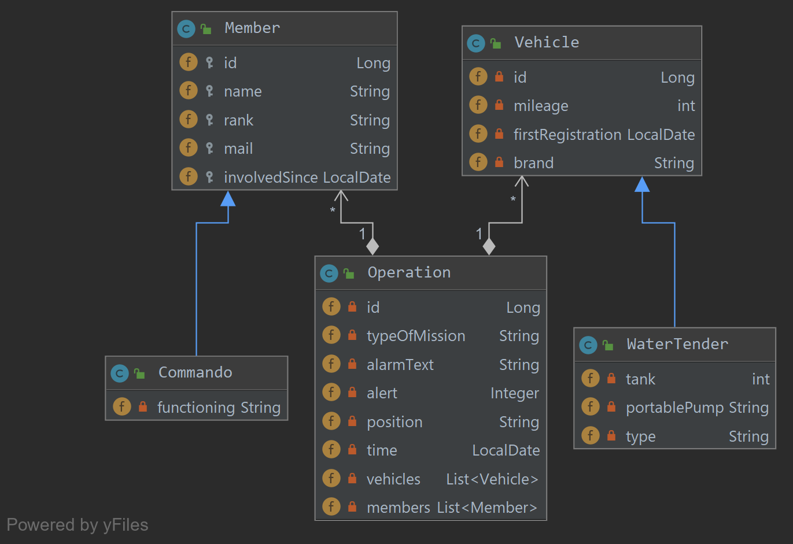
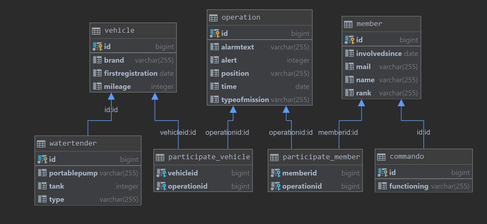

# Übung Quarkus mit JPA, Jonas Schürz

Mein Programm verwaltet eine Feuerwehr inkl. Einsätze, Mannschaft und Fahrzeuge.
### CLD



### ERD



### Datenbank starten(Postgres)
``` docker run --name some-postgres -p 5432:5432 -e POSTGRES_PASSWORD=passme -d postgres ```
mit folgender Konfiguration(unter resources/META-INF/application.properties eintragen):

``` 
quarkus.datasource.url=jdbc:postgresql://localhost/postgres
quarkus.datasource.driver=org.postgresql.Driver
quarkus.datasource.username=postgres
quarkus.datasource.password=passme
quarkus.datasource.min-size=3
quarkus.datasource.max-size=13

quarkus.hibernate-orm.database.generation=drop-and-create
```

### Projekt starten
``` mvnw compile quarkus:dev ```

### Endpoints

``` http://localhost:8080/api/member/findAll ```
``` http://localhost:8080/api/operation/findAll ```
``` http://localhost:8080/api/vehicle/findAll ```
